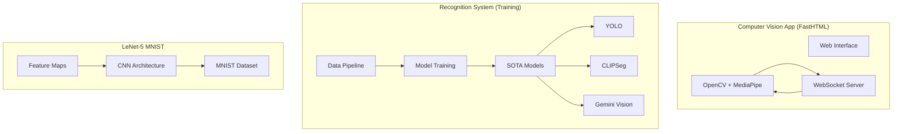

# 🚀 NLW Operator — Trilha Python: Visão Computacional

Bem-vindo ao repositório do projeto **NLW Operator Visão Computacional**. Este workspace contém uma coleção de projetos e experimentos desenvolvidos durante a trilha Python de Visão Computacional da NLW Operator da Rocketseat, focando em Deep Learning, Reconhecimento de Gestos em tempo real e técnicas avançadas de Visão Computacional.

Redes neurais convolucionais (CNNs) vs Vision Transformers (ViT)

---

## 🌐🇧🇷 [Versão em Português](README.md)
## 🌐🇺🇸 [English Version](README_EN.md)

---

## 📸 Visual do Projeto

<div align="center">
  
  
  
  
</div>

---

## 📂 Estrutura do Projeto

Este monorepo está dividido em três módulos principais, um para cada aula:

### 1. [🧠 LeNet-5 MNIST](./lenet)

Uma implementação moderna da clássica arquitetura **LeNet-5** utilizando **PyTorch** para classificação de dígitos manuscritos.

- **Tecnologias principais**: PyTorch, Jupyter, Matplotlib
- **Destaques**: Camadas CNN customizadas, visualização de mapas de características (feature maps), análise de erros no dataset MNIST
- **Redes Neurais**: CNNs (Convolutional Neural Networks) vs Vision Transformers (ViT)

### 2. [🔬 Recognition System & Lab](./recog_system)

A "sala de máquinas" onde os modelos de gestos são treinados, junto com notebooks exploratórios para modelos SOTA (State of the Art).

- **Tecnologias principais**: Scikit-Learn, MediaPipe, YOLO, CLIPSeg, Gemini Vision, Google Cloud Vision API, Hugging Face
- **Destaques**: Pipeline de coleta de dados customizado, scripts de treinamento de modelo e experimentação com detecção de objetos e segmentação
- **⚠️ Requisito**: Necessário baixar modelos do MediaPipe (veja o README do módulo)

### 3. [🖐️ Computer Vision App](./computer_vision_app)

Uma aplicação web de alta performance construída com **FastHTML** e **MediaPipe** para reconhecimento de gestos faciais/mãos em tempo real via WebSockets.

- **Tecnologias principais**: FastHTML, OpenCV, MediaPipe, Scikit-Learn
- **Destaques**: Processamento de vídeo de baixa latência, interface interativa, monitoramento de FPS em tempo real
- **⚠️ Requisito**: Necessário baixar modelos do MediaPipe (veja o README do módulo)

---

## 📊 Arquitetura do Sistema



---

## ✔️ Stack Tecnológica Global

| Categoria | Tecnologia |
|-----------|------------|
| **Linguagem** | Python 3.14+ |
| **Gerenciador** | uv |
| **DL Framework** | PyTorch, torchvision |
| **Visão Computacional** | OpenCV, MediaPipe |
| **Web App** | FastHTML, Uvicorn |
| **ML** | Scikit-Learn |
| **SOTA Models** | YOLO, CLIPSeg, ViT |
| **APIs** | Google Gemini, Google Cloud Vision |
| **Visualização** | Matplotlib, Jupyter |

---

## 🛠️ Como Começar

### Pré-requisitos

Certifique-se de ter o [uv](https://github.com/astral-sh/uv) instalado. Ele é utilizado em todos os módulos para um gerenciamento de dependências rápido e confiável.

```bash
# Verificar versão do uv
uv --version
```

### Instalação

1. **Clone o repositório**:
   ```bash
   git clone <repository-url>
   cd nlw-operator-computer-vision-main
   ```

2. **Explore os Módulos**:
   Cada subpasta possui seu próprio `pyproject.toml` e ambiente. Navegue até um módulo específico para começar:

   ```bash
   # Módulo 1: LeNet-5
   cd lenet
   uv sync

   # Módulo 2: Recognition System
   cd recog_system
   uv sync

   # Módulo 3: Computer Vision App
   cd computer_vision_app
   uv sync
   ```

### Instalação de Modelos MediaPipe

Alguns módulos requerem modelos do MediaPipe. Consulte a [documentação oficial](https://ai.google.dev/edge/mediapipe/solutions/guide) para download.

---

## ⚙️ Configuração de Variáveis de Ambiente

Para módulos que utilizam APIs externas, configure as variáveis de ambiente:

```bash
# Google Gemini API (OBRIGATÓRIO para recog_system)
GEMINI_API_KEY=your-gemini-api-key-here

# Google Cloud Vision API (opcional)
GOOGLE_CLOUD_VISION_API_KEY=your-cloud-vision-key-here
```

---

## 🔄 Visão Geral das Tarefas de Visão Computacional

| Tarefa | Descrição | Exemplos de Uso |
|--------|-----------|-----------------|
| **Image Classification** | Classificação de imagens em categorias | MNIST dígitos, objetos |
| **Object Detection** | Localização de objetos em imagens | YOLO, detecção de faces |
| **Image Segmentation** | Segmentação pixel-a-pixel | CLIPSeg, masks |
| **Interactive Segmentation** | Segmentação interativa | Ferramentas de edição |
| **Gesture Recognition** | Reconhecimento de gestos | Mãos, facial |
| **Hand Landmark Detection** | Detecção de pontos da mão | 21 pontos por mão |
| **Face Detection** | Detecção de faces | Cascatas, MediaPipe |
| **Pose Landmark Detection** | Detecção de pose corporal | 33 pontos do corpo |

---

## 📚 Recursos e Links Úteis

### Ferramentas de Design
- [Excalidraw](https://excalidraw.com/) - Explicações visuais e diagramas
- [Pencil](https://www.pencil.dev/) - Prototipagem

### Modelos e Datasets
- [Hugging Face Models](https://huggingface.co/models) - Modelos pré-treinados por tarefa
- [MediaPipe](https://ai.google.dev/edge/mediapipe/solutions/guide) - Modelos de visão do Google
- [PyTorch Hub](https://pytorch.org/hub/) - Modelos PyTorch

### Documentações
- [Google Cloud Vision](https://cloud.google.com/vision) - API de visão do Google
- [OpenCV](https://opencv.org/) - Biblioteca de visão computacional
- [PyTorch](https://pytorch.org/) - Framework de deep learning

---

## 🌐 Deploy

Para fazer deploy do Computer Vision App:

1. **Render/Railway** (Recomendado para Python/FastHTML):
   ```bash
   # Configure o ambiente e faça push
   git push origin main
   ```

2. **Local com Docker**:
   ```bash
   cd computer_vision_app
   docker build -t cv-app .
   docker run -p 8000:8000 cv-app
   ```

---

## 📄 Licença

Este projeto foi desenvolvido para fins educacionais durante o **NLW Operator** da Rocketseat.

---

## 🤝 Agradecimentos

- [Rocketseat](https://rocketseat.com.br) pelo evento NLW
- Feito com ❤️ por **Arthur Kamienski**
