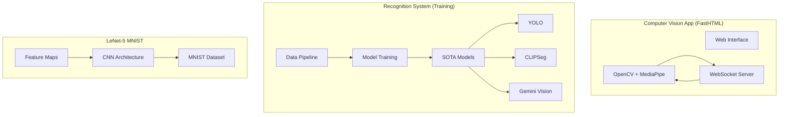

# 🚀 NLW Operator — Python Track: Computer Vision

Welcome to the **NLW Operator Computer Vision** project repository. This workspace contains a collection of projects and experiments developed during the Python Computer Vision track of NLW Operator from Rocketseat, focusing on Deep Learning, Real-Time Gesture Recognition, and advanced Computer Vision techniques.

Convolutional Neural Networks (CNNs) vs Vision Transformers (ViT)

---

## 🌐🇧🇷 [Versão em Português](README.md)
## 🌐🇺🇸 [English Version](README_EN.md)

---

## 📸 Project Screenshots

<div align="center">
  
  
  
  
</div>

---

## 📂 Project Structure

This monorepo is divided into three main modules, one for each lesson:

### 1. [🧠 LeNet-5 MNIST](./lenet)

A modern implementation of the classic **LeNet-5** architecture using **PyTorch** for handwritten digit classification.

- **Main technologies**: PyTorch, Jupyter, Matplotlib
- **Highlights**: Custom CNN layers, feature maps visualization, MNIST error analysis
- **Neural Networks**: CNNs vs Vision Transformers (ViT)

### 2. [🔬 Recognition System & Lab](./recog_system)

The "engine room" where gesture models are trained, along with exploratory notebooks for SOTA (State of the Art) models.

- **Main technologies**: Scikit-Learn, MediaPipe, YOLO, CLIPSeg, Gemini Vision, Google Cloud Vision API, Hugging Face
- **Highlights**: Custom data collection pipeline, model training scripts, object detection and segmentation experiments
- **⚠️ Requirement**: Must download MediaPipe models (see module README)

### 3. [🖐️ Computer Vision App](./computer_vision_app)

A high-performance web application built with **FastHTML** and **MediaPipe** for real-time facial/hand gesture recognition via WebSockets.

- **Main technologies**: FastHTML, OpenCV, MediaPipe, Scikit-Learn
- **Highlights**: Low-latency video processing, interactive interface, real-time FPS monitoring
- **⚠️ Requirement**: Must download MediaPipe models (see module README)

---

## 📊 System Architecture



---

## ✔️ Global Tech Stack

| Category | Technology |
|----------|------------|
| **Language** | Python 3.14+ |
| **Package Manager** | uv |
| **DL Framework** | PyTorch, torchvision |
| **Computer Vision** | OpenCV, MediaPipe |
| **Web App** | FastHTML, Uvicorn |
| **ML** | Scikit-Learn |
| **SOTA Models** | YOLO, CLIPSeg, ViT |
| **APIs** | Google Gemini, Google Cloud Vision |
| **Visualization** | Matplotlib, Jupyter |

---

## 🛠️ Getting Started

### Prerequisites

Make sure you have [uv](https://github.com/astral-sh/uv) installed. It's used in all modules for fast and reliable dependency management.

```bash
# Check uv version
uv --version
```

### Installation

1. **Clone the repository**:
   ```bash
   git clone <repository-url>
   cd nlw-operator-computer-vision-main
   ```

2. **Explore the Modules**:
   Each subfolder has its own `pyproject.toml` and environment. Navigate to a specific module to get started:

   ```bash
   # Module 1: LeNet-5
   cd lenet
   uv sync

   # Module 2: Recognition System
   cd recog_system
   uv sync

   # Module 3: Computer Vision App
   cd computer_vision_app
   uv sync
   ```

### MediaPipe Models Installation

Some modules require MediaPipe models. Check the [official documentation](https://ai.google.dev/edge/mediapipe/solutions/guide) for downloads.

---

## ⚙️ Environment Variables Configuration

For modules using external APIs, configure environment variables:

```bash
# Google Gemini API (REQUIRED for recog_system)
GEMINI_API_KEY=your-gemini-api-key-here

# Google Cloud Vision API (optional)
GOOGLE_CLOUD_VISION_API_KEY=your-cloud-vision-key-here
```

---

## 🔄 Computer Vision Tasks Overview

| Task | Description | Use Cases |
|------|-------------|-----------|
| **Image Classification** | Classify images into categories | MNIST digits, objects |
| **Object Detection** | Locate objects in images | YOLO, face detection |
| **Image Segmentation** | Pixel-by-pixel segmentation | CLIPSeg, masks |
| **Interactive Segmentation** | Interactive segmentation | Editing tools |
| **Gesture Recognition** | Gesture recognition | Hands, facial |
| **Hand Landmark Detection** | Hand keypoint detection | 21 points per hand |
| **Face Detection** | Face detection | Cascades, MediaPipe |
| **Pose Landmark Detection** | Body pose detection | 33 body points |

---

## 📚 Resources and Useful Links

### Design Tools
- [Excalidraw](https://excalidraw.com/) - Visual explanations and diagrams
- [Pencil](https://www.pencil.dev/) - Prototyping

### Models and Datasets
- [Hugging Face Models](https://huggingface.co/models) - Pre-trained models by task
- [MediaPipe](https://ai.google.dev/edge/mediapipe/solutions/guide) - Google vision models
- [PyTorch Hub](https://pytorch.org/hub/) - PyTorch models

### Documentation
- [Google Cloud Vision](https://cloud.google.com/vision) - Google vision API
- [OpenCV](https://opencv.org/) - Computer vision library
- [PyTorch](https://pytorch.org/) - Deep learning framework

---

## 🌐 Deploy

To deploy the Computer Vision App:

1. **Render/Railway** (Recommended for Python/FastHTML):
   ```bash
   # Configure environment and push
   git push origin main
   ```

2. **Local with Docker**:
   ```bash
   cd computer_vision_app
   docker build -t cv-app .
   docker run -p 8000:8000 cv-app
   ```

---

## 📄 License

This project was developed for educational purposes during the **NLW Operator** from Rocketseat.

---

## 🤝 Acknowledgments

- [Rocketseat](https://rocketseat.com.br) for the NLW event
- Made with ❤️ by **Arthur Kamienski**
